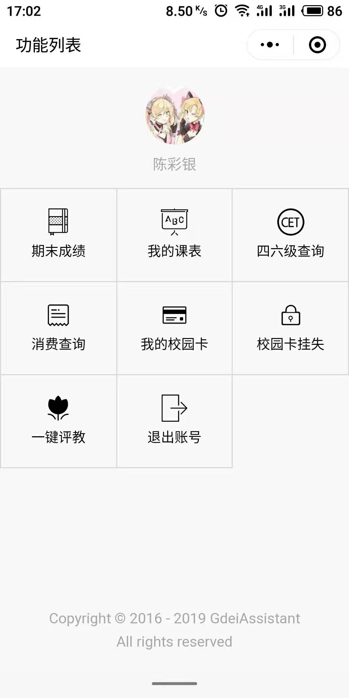
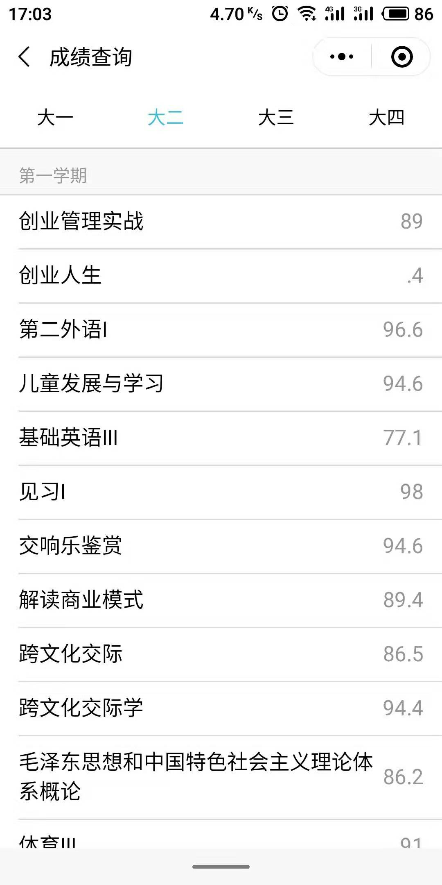
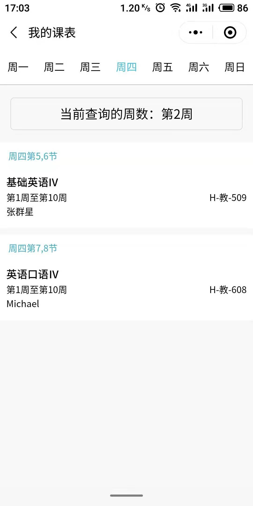

  

# 广东二师助手微信小程序

**广东二师助手**是一款旨在为广东第二师范学院在校师生提供最便捷获取校园生活、社团活动、教务信息的校园应用，提供了课表查询、成绩查询、四六级考试成绩查询、校园卡充值挂失和消费查询等综合性的服务与功能。

## 功能

- 成绩查询
- 课表查询
- 四六级查询
- 一键评教
- 消费查询
- 馆藏查询
- 校园卡查询
- 校园卡挂失

## 预览

  
  
  

## 体验

  

## 相关

广东二师助手微信小程序的后端API数据接口由[广东第二师范学院校园助手系统](https://github.com/SweetRadish/GdeiAssistant)提供

## 协议

[MIT](http://opensource.org/licenses/MIT)

Copyright (c) 2016 - 2019 GdeiAssistant

## 贡献

- 若你喜欢本项目，欢迎Star本项目

- 要贡献代码，欢迎Fork之后再提交[Pull Request](https://github.com/SweetRadish/GdeiAssistant-WechatApp/pulls)

- 如果你有好的意见或建议，欢迎给我们提交[Issue](https://github.com/SweetRadish/GdeiAssistant-WechatApp/issues)

## 联系

- 邮箱：[gdeiassistant@gmail.com](mailto:gdeiassistant@gmail.com)

## 声明

本项目只用作个人学习研究，如因使用本项目导致任何损失，本人概不负责。