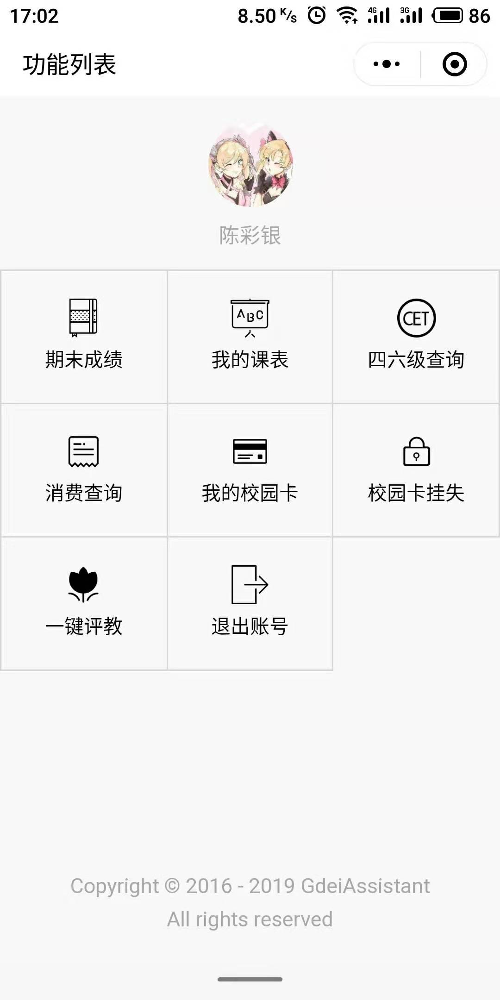
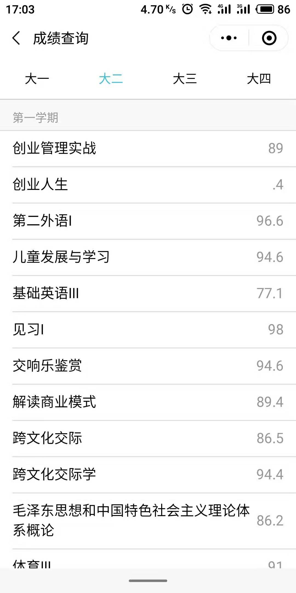
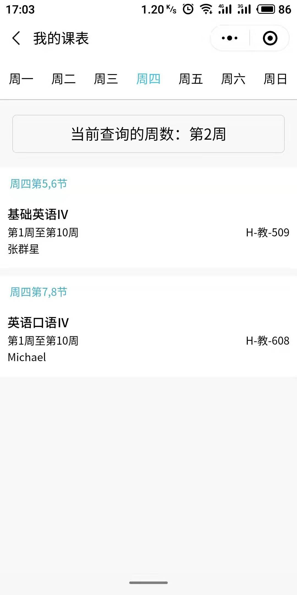

<p align="center">
  
</p>

# 广东二师助手微信小程序

广东第二师范学院校园助手系统微信小程序客户端。项目基于微信小程序框架开发，UI 样式采用 WeUI，支持微信与 QQ 小程序双端运行。

## 功能列表

- 成绩查询
- 课表查询
- 四六级查询
- 一键评教
- 消费查询
- 借阅查询
- 馆藏查询
- 校园卡查询
- 校园卡挂失

## 页面预览

<p>
  
  
  
</p>

## 运行环境

- 微信小程序基础库：`>= 2.3.0`
- QQ 小程序：兼容微信小程序大部分语法与 API

## 快速开始

### 1. 克隆仓库

```bash
git clone https://github.com/GdeiAssistant/GdeiAssistant-WechatApp.git
```

### 2. 导入开发工具

使用微信开发者工具或 QQ 小程序开发工具导入项目根目录。

### 3. 配置后端域名

默认资源域名与请求配置位于：

- `config/index.js`

运行环境会根据小程序构建环境自动匹配（`develop -> dev`，`trial/release -> prod`）。
如需自定义后端域名，可直接修改该文件中的环境配置。

## 项目结构

```text
.
├─ pages/                # 页面目录
├─ services/             # 请求、鉴权、API 领域服务
│  ├─ request.js         # 统一请求入口
│  ├─ auth.js            # 会话令牌管理
│  ├─ endpoints.js       # 接口路径集中定义
│  └─ apis/              # 业务 API 分层
├─ config/               # 运行配置
├─ utils/                # 通用工具函数
└─ common/lib/weui.wxss  # WeUI 样式库
```

## 后端接口

本项目依赖广东第二师范学院校园助手系统后端：

- 后端仓库：<https://github.com/GdeiAssistant/GdeiAssistant>
- API 文档：<https://github.com/GdeiAssistant/GdeiAssistant/wiki>

## 兼容性说明

项目已包含微信/QQ 平台差异处理逻辑，可同时支持微信小程序与 QQ 小程序。

## 贡献

- 欢迎提交 Issue 反馈问题与建议。
- 欢迎 Fork 后发起 Pull Request 参与改进。

## 协议

- [Apache License 2.0](https://www.apache.org/licenses/LICENSE-2.0)

Copyright (c) 2016 - 2026 GdeiAssistant

## 联系方式

- 技术支持与建议反馈：<gdeiassistant@gmail.com>
- 客服与系统故障工单：<support@gdeiassistant.cn>
- 社区违法和不良信息举报：<report@gdeiassistant.cn>

## 致谢

- [WeUI](https://github.com/Tencent/weui-wxss)

## 声明

本项目仅用于学习与研究用途。使用本项目造成的任何损失，开发者不承担责任。
